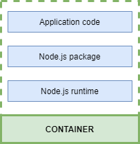
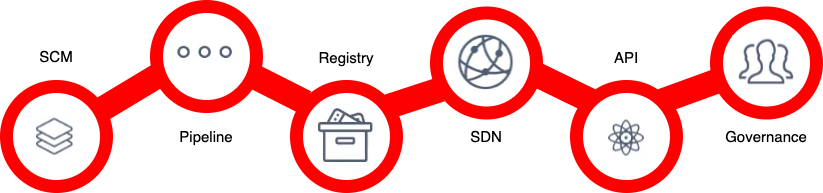
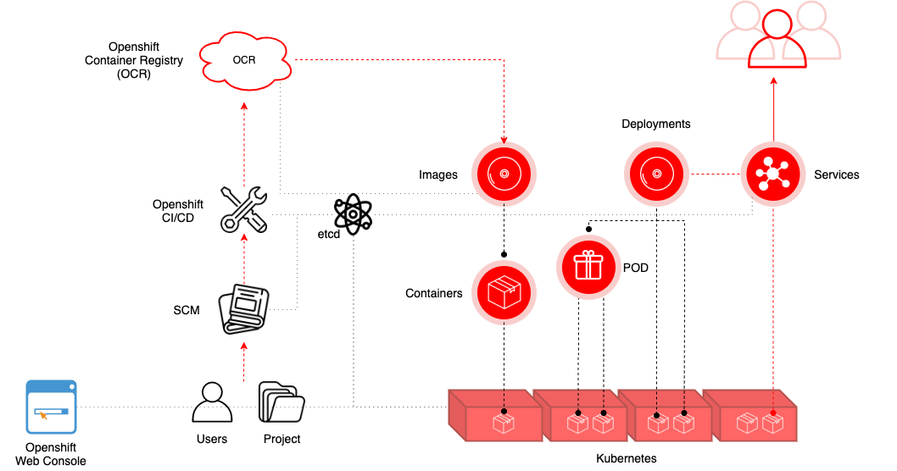
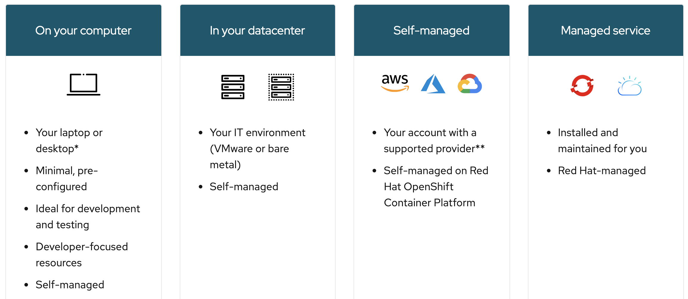
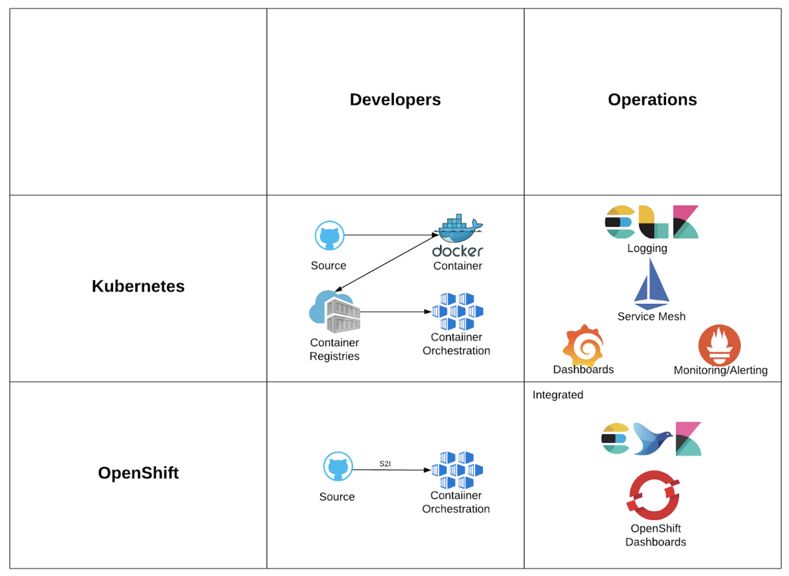

# Openshift

**Table of contents**
1. [Understanding the Container Application Architecture?](#understanding-container)
2. [What is Openshift?](#what-is)
3. [Openshift Tools](#openshift-tools)
4. [Openshift Architectural Overview](#architectural-diagram)
5. [Openshift concepts - Projects and Users](#openshift-concept)
6. [Get started with Openshift](#example)
7. [Alternatives](#alternatives)
8. [Kubernetes vs OpenShift](#k8s-vs-openshift)
9. [Further Reading](#further-reading)

## Understanding the Container Application Architecture 
* Containers as a way to package applications
* Containers as a way to isolate applications (processes)
    * CPU
    * Network
    * Memory
    * Other processes

_example:_

## What is Red Hat Openshift? 
Openshift is Red Hat open source container application platform for developing and hosting enterprise grade applications.
Openshift is Red Hat platform as a service offering.

> doc: https://docs.openshift.com/

Openshift has four different flavors namely

| Openshift Origin | Openshift Online | Openshift Dedicated | Openshift Enterprise |
| ------ | ------ | ------ | ------ |
| Open source application container platform | Public Application Development hosting service | Managed private cluster on AWS/Google Clouds | On-Premise private PaaS |

Openshift is based on top of Docker containers and Kubernetes cluster manager, with added developer and operational centric Tools that enable rapid application development, deployment and lifecycle management.
* Docker is the fundamental technology that powers the development of containerized applications in the form of reusable images. Docker enables us to create an image of our application with all the required dependencies prepackaged into images that can be instantly deployed in any environment.
* Kubernetes (or k8s) powers deployment and management of these Docker images across large clusters by providing self-healing and auto-scaling features.
* Openshift builds on these technologies by providing a layer of tools that abstract the underlying Kubernetes and infrastructure management tasks, to help developers easily deploy and manage their applications on the Kubernetes based infrastructure.

## Openshift Tools 
Openshift adds suport for developer tools such as
* **SCM**: integration with Source Code Management softwares like GitLab.
* **Pipeline**: integration with build pipelines that helps developers rapidly and consistently develop, build, test and deploy applications.
* **Registry**: helps manage Docker images of your application by providing a built in registry.
* **SDN**: support for Software Defined Network that provides networking capabilities out of the box.
* **API**: is API centric and has a rich and weel-documented set of API's that helps us easily integrate Openshift with our existing infrastructure.
* **Governance**: provides out of the box support for projects teams and users to organize and manage access to applications.

## Openshift Architectural Overview 
* Containers and images are the building blocks for deploying your applications.
* Pods and services allow for containers to communicate with each other and proxy connections.
* Projects and users provide the space and means for communities to organize and manage their content together.
* Deployments add expanded support for the software development and deployment lifecycle.

## Get started with Openshift 
There are multiple options available to set up Openshift. Openshift can be installed on premises or hosted on public or private clouds.

[Try your own clusters in the environment of your choice and learn about the possibilities of using a Red Hat Openshift
](https://www.openshift.com/try?extIdCarryOver=true&sc_cid=701f2000001Css5AAC)

## Alternatives 
We can find different alternatives to OpenShift with pros / cons, but this will mainly depend on your needs and integrations with other solutions.
Note that, Red Hat Openshift is emerging as one of the leaders in the cloud-native development platform space.
* Rancher
* Gitlabs integrated CI
* Docker Swarm
* etc.

## Kubernetes vs OpenShift 
To choose between Kubernetes and OpenShift a CTO/CIO should consider the following aspects.
Should consider Kubernetes if;
* Their company or companies are already using a mature Kubernetes platform or have existing knowledge of the Kubernetes product portfolio.
* There is a requirement for Middleware, which is better suited to Kubernetes.
* Utilising the latest open source technology is valued at the company.
* Their company or companies have a preference or requirement, to keep CI/CD outside of the cluster.

Should consider OpenShift if;
* Their company or companies have existing Red Hat subscriptions and investment in OpenShift.
* Red Hat based middleware is used or preferred.
* Their company or companies value security hardened, pre integrated and/or tested open source solutions. 
* A user-friendly turn-key solution with limited admin overhead is preferred.
* Kubernetes environments in multi/hybrid cloud scenarios need to be managed.
* Built-in CI/CD features are expected.

Developers and Operations are always looking at IT solutions from different, sometimes closed-minded, points of view. 

_source: https://nordcloud.com/kubernetes-the-simple-way_

## Further Reading 
* [What’s in Red Hat OpenShift Service Mesh](https://www.openshift.com/learn/topics/service-mesh)
* [Red Hat Ansible Automation Platform and Red Hat OpenShift](https://www.openshift.com/learn/topics/ansible)